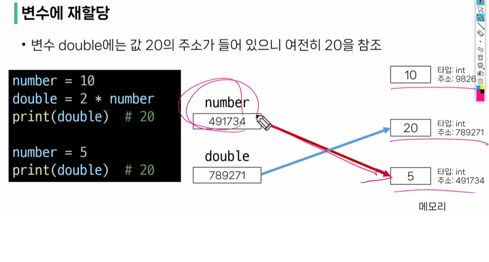

# 전반적인 일정

파이썬 / 알고리즘 / web /  벡엔드 /  JS / 프론트엔드 

# 파이썬 인터프리터 사용하는 2가지 방법

### 1. shell프로그램

git bash에서 python -i 

esc로 종료

### 2. 확장자가 .py 인 파일에 작성된 파이썬 프로그램 실행

# 연산자 우선순위

**높음 ** ---------------------------------------------------------------------------------------------------- **낮음**

**                                         -(음수)                          * / // %                                        + -

!!주의   -2**4 =  -16    헷갈림 방지위해 ( )써야

# 변수명 규칙

* 숫자로 시작할 수 없음

# 객체( Object )

타입을 갖는 메모리 주소 내 값

!!주의

# Style Guide

Code invention link https://peps.python.org/pep-0008/

### 변수

* is_hot       True or False  값을 갖는 변수명 설정 예시

* 전체가 대문자인 변수(_포함 가능) : 상수 (고정)

* snake case (_를 사용)

### 코드 블럭 들여쓰기

* 공백 4칸 (=tab)

### 기타

* 함수 정의나 클래스 정의 등의 블록 사이에는 빈 줄을 추가 (2줄이 정석)
* 연산자 사이에 공백 두기
* 

# 주석

한줄주석:  # 

여러줄 주석:  드래그 ctrl + /        (해소도 마찬가지)

''' 설명'''

# 조언

* 파이썬 먼저 잘해놓고 (나 잘해요 할때까지)  (회사에서?) 자바, C++,C# 하기

* 파이썬을 배웠다고 파이썬 사용 기업에만 갈 수 있는 것은 아니다.

* 내가 원하는 회사에서 사용하는 언어와 툴은 입사하고 나서 배움

* 파이썬으로 알고리즘을 푸는 것은 다른 언어로 푸는 것보다 조금이라도 유리한 위치에서 시작하는 것이다.

# 인터프리터 언어 vs.  컴파일 언어

* 인터프리터 (interpreter) : Python, Ruby, Javascript 

* 컴파일러 (compiler): C,C++,JAVA

* 인터프리터 언어는 자료형을 지정하지 않아도 되지만 ,컴파일은 지정해줘야 한다.

여기까지  수정함
